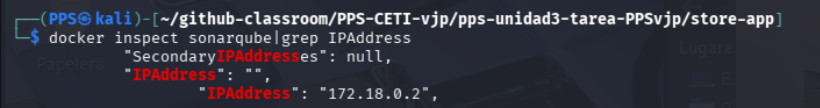

# Actividad obligatoria Unidad 3 - Tarea RA3. Detección y corrección de vulnerabilidades de aplicaciones web


**Índice**

[Objetivos](#objetivos)

[Resultados de aprendizaje y Criterios de Evaluación](#resultados-de-aprendizaje-y-criterios-de-evaluación)

[Desarrollo](#desarrollo)

[Entrega](#entrega)


---
# Objetivos

1. Comprender los principios del desarrollo seguro de aplicaciones web y su integración en el ciclo de vida del software.

1. Identificar y analizar las principales vulnerabilidades recogidas en el OWASP Top Ten y su impacto sobre la seguridad de los sistemas.

1. Aplicar técnicas de validación y sanitización de entradas en formularios para prevenir ataques de inyección.

1. Conocer y emplear estándares actuales de autenticación y autorización (como OAuth2, OpenID Connect y SAML).

1. Detectar y prevenir ataques de robo o secuestro de sesión mediante mecanismos de protección de cookies y tokens.

1. Implementar buenas prácticas en el almacenamiento seguro de contraseñas usando algoritmos de hash y salting adecuados.

1. Evaluar y aplicar contramedidas avanzadas como HSTS, CSP y CAPTCHAs para mitigar vulnerabilidades comunes.

1. Analizar vulnerabilidades web reales y proponer estrategias de mitigación basadas en herramientas y auditorías.

1. Conocer el funcionamiento y los beneficios de los Web Application Firewalls (WAF) en la protección de portales y aplicaciones.

---
# Resultados de aprendizaje y Criterios de Evaluación

Esta actividad se relaciona con el resultado de aprendizaje y criterios de evaluación RA 3 a, b, c, d, e, f y g.

---
# Desarrollo

Lee la tarea hasta el final para ver lo que tienes que entregar e ir cogiendo las evidencias y ver lo que tienes que documentar.

## Clonar repositorio de la tarea.

Utilizaremos `GitHub Classroom` para la entrega de esta actividad.

- Usa el código de invitación que tienes en la plataforma moodle para esta tarea. Acepta la invitación i sigue los pasos que te indican:


Puedes acceder a la tarea desde el enlace de `github` o clonando el repositorio desde `Visual Studio Code`.


Si le das a Acceder con Visual Studio Code, tendrás que dar a permitir abrir, enlaces, descargar extensiones para vscode, confiar en los autores,etc. Se creará tu repositorio en `$HOME/Github-classroom/`.


- Si le das al repositorio, te llevará a tu repositorio. Te habrá creado un repositorio en tu espacio personal que tendrás que modificar.


- Desde mi panel de control tendré acceso a tu repositorio, o sea que ya no tendrás que poner tu repositorio como público, yo como profesor tendré acceso.

---
## Apartado 1 -  Actividad: Creación del entorno de Pruebas.

Crea el [entorno de pruebas indicado en la actividad](../Actividad-CreacionEntornoPrueba/README.md).
Crea un archivo en `MarkDown` con nombre `CreaciónEntornoPrueba.md` donde **brevémente**, expliques cómo has creado el entorno de pruebas e incorpore capturas de pantalla donde se pueda ver la que se ha creado correctamente.

---
## Apartado 2 - Vulnerabilidades de inyección de datos de entrada.

Realiza alguna de las actividades que tienen que ver con **vulnerabilidades de inyección de código** o de **otros tipos vulnerabilidades de entrada**.

Crea un documento en `Markdown` con nombre `ActividadVulnerabilidadesDatosEntrada.md` donde pegarás las capturas de pantalla que evidencien la realización de:

- Estado inicial y vulnerabilidad.
- Solución o mitigación 1 implementeada,(no es necesario poner todos los pasos).
- Solución o mitigación 2 implementeada.
...
- Incorpora tambien un par de lineas para cada solución implementada, indicando qué medidas hemos tomado para securizar o mitigar los ataques.

----
## Apartado 3 - Actividad de Autenticación, vulnerabilidades de gestión de sesiones, protección de datos sensibles o Control de acceso.

Realiza alguna de las actividades que tienen que ver con vulnerabilidades que tienen que ver con **Autenticación y vulnerabilidades de gestión de sesiones**  o de **Protección de datos sensibles y Control de acceso**.

Crea un documento en `Markdown` con nombre `ActividadAutenticacion.md` donde pegarás las capturas de pantalla que evidencien la realización de:

- Estado inicial y vulnerabilidad.
- Solución o mitigación 1 implementeada,(no es necesario poner todos los pasos).
- Solución o mitigación 2 implementeada.
...
- Incorpora tambien un par de lineas para cada solución implementada, indicando qué medidas hemos tomado para securizar o mitigar los ataques.

---
## Apartado 4 - Actividad sobre errores en la Seguridad y componentes vulnerables.

Realiza alguna de las actividades que tienen que ver con vulnerabilidades que tienen que ver con **errores en la seguridad y componentes vulnerables**.

Crea un documento en `Markdown` con nombre `ActividadSeguridad` donde pegarás las capturas de pantalla que evidencien la realización de:

- Estado inicial y vulnerabilidad.
- Solución o mitigación 1 implementeada,(no es necesario poner todos los pasos).
- Solución o mitigación 2 implementeada.
...
- Incorpora tambien un par de lineas para cada solución implementada, indicando qué medidas hemos tomado para securizar o mitigar los ataques.

---
## Apartado 5 - Escaneo estático, dinámico y de Dependencias de librerias de una aplicación web.

En el repositorio tienes en una [aplicación spring java con nombre store_app](./files/store-app.zip).

Deberás descomprimirla. Todas las operaciones indicadas en adelante, se realizarán sobre la carpeta de la aplicación `store-app`.

Estas son las diferentes operaciones a realizar en este apartado:
1. Realiza sobre ella un Análisis Estático de Código  (SAST) con la herramienta `SonarQube`.
1. Crea un contenedor docker donde se ejecute la aplicación para poder realizar el escaneo de seguridad dinámico.
1. Realiza un Análisis de Seguridad con una herramienta DAST (`Nessus` o `OwASP ZAP`).
1. Realiza un Análisis de dependencia de librerías con `OWASP Dependency Check`.
1. Realiza una tabla con algunos de los problemas encontrados en los análisis

Vamos desgranando los pasos. Presta especial atención al apartado 5-1 donde se vé la creación del la imagen de contenedor con la compilación y ejecución de la aplicación.

### Apartado 5 - 1. Ejecución de la aplicación.

> Aquí tienes las indicaciones para realizarlo sobre la MV de Kali Linux que estamos utilizando para las actividades.
>
> Crearemos un contenedor docker para levantar la aplicación.

Para ejecutar la aplicación, al ser una aplicación en Java, tenemos que compilarla primero para generar los archivos `bytecode` que son los que se ejecutaran en la MV de Java.

Nuestra aplicación esta desarrollada en `Spring Java` por lo que utiliza java 11 . Por ello tenemos que compilarla en esa versión de java.

Vamos a ejecutar la aplicación en un contenedor docker en el cual crearemos una máquina java personalizada en la cual vamos a compilar mientras creamos dicha imagen.

También podríamos hacer todo el proceso sobre un SO, instalado `java 11` en él y posteriormente instalando y compilando con `Maven`.

En nuestro caso con Docker, utilizamos un `Dockerfile` que recordamos que es un archivo en el cual especificamos las características de la máquina y las operaciones que hay que hacer al crearla, en este caso realiza la imagen en dos pasos:
- Paso 1. Compila con `Maven` el proyecto.
- Paso 2. Ejecuta la aplicación con la MV de Java.

Además tendrá que copiar los archivos de las archivos bitecode generados, código fuente y pom.xml para que podamos realizar el análisis estático de código en el contenedor.

[`store-app/Dockerfile`](./files/Dockerfile)
```dockerfile
# ===== Etapa 1: Build con Maven + JDK 11 =====
FROM maven:3.8.7-eclipse-temurin-11 AS build
WORKDIR /app
COPY pom.xml .
COPY src ./src
RUN mvn clean package -DskipTests

# ===== Etapa 2: Runtime con JRE 11 =====
FROM eclipse-temurin:11-jre
WORKDIR /app
COPY --from=build /app/target/*.jar app.jar
COPY --from=build /app/target/classes ./target/classes
COPY --from=build /app/src ./src
COPY --from=build /app/pom.xml ./pom.xml
# Copia Maven ligero para sql-maven-plugin (usa el de build)
COPY --from=build /usr/share/maven /usr/share/maven
ENV PATH="/usr/share/maven/bin:${PATH}"

EXPOSE 8888
VOLUME ["/app/work", "/app/work/logs"]

# ENTRYPOINT: crea BD con sql-maven-plugin (usa src/main/resources/*.sql del pom)
ENTRYPOINT ["sh", "-c", "mvn sql:execute -Dsql.format=false && java -jar app.jar"]
```

Para crear el contenedor usamos `Docker compose`.  
En este archivo tienes el docker-compose.yml de todo el escenario completo: `store-app` + `SonarQube` + `Nessus` Configurado.  
Si quieres puedes modificarlo por ejemplo dejando únicamente `app` + `SonarQube` para el análisis estático y luego `app` y `Nessus` para el dinámico.   
Si tu equipo no tiene problemas de estabilidad y no se bloquea puedes usar el completo.


[`docker-compose.yml`](./files/docker-compose.yml)
```yml
services:
  store-app:
    build: .
    container_name: store-app
    ports:
      - "8888:8888"
 # Esta es el servicio de SonarQube para el análisis estático de Código
  sonarqube:
    image: sonarqube
    container_name: sonarqube
    environment:
      - SONAR_ES_BOOTSTRAP_CHECKS_DISABLE=true
    ports:
      - "9000:9000"
# Este servicio no tiene los plugins y hay que instalarlos manualmente, por eso se ha cambiado la imagen a una que ya los tiene instalados
# pero lo tienes aquí por si quieres probarlo con la imagen oficial de Nessus y luego instalar los plugins manualmente
# en vez de usar la imagen personalizada de abajo.
#  nessus:
#    image: nessus/nessus
#    container_name: nessus
#    ports:
#      - "8834:8834"
  nessus:  
     # Nessus Vulnerability Scanner  
    image: jmmedinac03/nessus_plugins  
        #    image: tenable/nessus:latest-ubuntu  
        #    restart: always  
        #    código de activacion nessus A2AA-KWWR-ZRSM-RW79-LBPH  
        #    acceso a la máquina por https://localhost:8834   
        #    creado usuario:usuario passwd:usuario  
    ports:  
      - 8834:8834  
```

Una vez hemos colocado estos dos archivos en la carpeta del proyecto `store-app`:

```bash

# Nos situamos en el directorio de la aplicación
cd ruta/a/carpeta/store-app

#  Levantar
docker compose up --build

# Para producción: docker compose up -d
```

Observa como se van mostrando los logs de los diferentes servicios y que te pueden informar de si se produjera un error para solucionarlo.


Esperamos a que se descargen las imágenes y se construya la nuestra personalizada (compilandose el código)  y despues de unos minutos ya accederíamos a los diferentes sevicios.

> Tendrás acceso  a las tres aplicaciones: `store-app` en <http://localhost:8888>, `SonarQube` en <http://localhost:9000> y `Nessus` en <https://localhost:8834>.
> Recuerda que las credenciales de `SonarQube` son usuario:admin passwd: admin y las de `Nessus` usuario:usuario passwd:usuario.

Aquí se muestra la entrada a la aplicación `store-app`:


### Apartado 5 - 2.  Escaneo estático.

Consulta en la actividad de la unidad 3 cómo realizar un análisis estático de código utilizando la aplicación `SonarQube` como servidor de análisis. Realiza el análisis estático de código para ver las debilidades y vulnerabilidades presentes.
> Recuerda que la información de vulnerabilidades obtenida tendrás que utilizarla para realizar la tabla final.

Te dejo aquí indicaciones:

El escaneo estático hay que hacerlo en el contenedor `store-app` ya que necesitamos tener acceso a las clases compiladas.  

Necesitamos saber la Ip donde se encuentra el servidor de `SonarQube`:

```bash
#obtenemos información de la ip del contenedor sonarqube por que nos hace falta para la configuración del escaner sonar:
docker inspect sonarqube|grep IPAddress

```
Anotamos la dirección



Y nos accedemos al contenedor de la aplicación para realizar el escaneo estático:

```bash
#accedemos al contenedor
docker exec -it store-app /bin/bash
```
Una vez dentro descargamos e instalamos el cliente sonar-scanner:

```bash
# Instalamos unzip para descomprimir el cliente y nano para editar los ficheros
apt update
apt install unzip nano 
# Descargar sonar-scanner.zip y traerlo a esta carpeta
wget https://binaries.sonarsource.com/Distribution/sonar-scanner-cli/sonar-scanner-cli-8.0.1.6346-linux-x64.zip
# Descomprimir sonar-Scanner-cli, se nos descomprime en una carpeta con nombre sonar-scanner-cli.
# Ojo que tu versión seguro que no es la misma
unzip sonar-scanner-cli-8.0.1.6346-linux-x64.zip 
# borramos el zip
rm sonar-scanner-cli-8.0.1.6346-linux-x64.zip 
# Renombra la carpeta para que el resto de los comandos te funcionen
mv sonar-scanner-8.0.1.6346-linux-x64/ sonar-scanner
```

Ponemos en la configuración de sonar-scanner la ip de nuestro contenedor `SonarQube`.

`sonar-scanner/conf/sonar-scanner.propierties`
```conf
# Comprueba si es la ip de tu servidor y sino pon la ip de tu servidor sonarqube
sonar.host.url=http://172.18.0.2:9000
```

Y ponemos el archivo de configuración del proyecto:
```bash
nano sonar-project.properties
```

[`app/sonar-project.properties`](./files/sonar-project.properties)
```conf
# Nombre del proyecto
sonar.projectName=store-app
sonar.projectKey=store-app

# Rutas de código fuente y binarios
sonar.sources=src/main
sonar.java.binaries=target/classes
```

> Recuerda que tendrás que acceder a `SonarQube` para crear un token que nos permita enviar el escaneo al servidor.

... y ejecutamos el escaneo:
```bash
sonar-scanner/bin/sonar-scanner -D sonar.token=squ_Tu_token
```

### Apartado 5 - 3. Análisis de seguridad con DAST.

Una vez levantantada la aplicación en el puerto 8888 ya estamos en disposición de poder escanearla con cualquiera de las aplicaciones DAST disponibles. En nuestro caso, en las actividades, hemos visto como podíamos comprobar la seguridad de las aplicaciones con Nessus y con OWASP ZAP.


### Apartado 5 - 4. Analísis de dependencias de librerías.

Realiza un análisis de dependencias de las librerías con `OWASP Dependency Check`. 

### Apartado 5 - 5. Análisis de los problemas encontrados.

Con los resultados del análisis estático y dinámico realiza una tabla con al menos 5 problemas en los que indicarás:

| - Vulnerabilidad     | Nombre/breve descripción de la vulnerabilidad    |
|----------------------|--------------------------------------------------|
| - CWE                | Código CWE y nombre                              |
| - Consecuencias      | Qué riesgos puede provocar la vulnerabilidad     |
| - Localización       | Archivos de la aplicación a los que afecta       |
| - Exploit(s)         | Como se “ataca” la aplicación                    |
| - Solución           |Modificaciones que podemos realizar en la aplicación para resolver la vulnerabilidad   |
| - Otra información     | Lo que consideres necesario para aclarar la vulnerabilidad |


---
# Entrega

## Indicaciones de entrega

Al acceder a la tarea en `classroom.github.com` se te ha creado un repositorio. En él es en el que tendrás que documentar la realización de los diferentes apartados de la tarea.

> Observa que al ser repositorio privado, por lo que no te va a permitir configurar `GitHub Pages`. No obstante deberás configurar `Mkdocs` para que genere las páginas html sobre los archivos `.md` donde estás documentando todo.
> Recuerda añadir toda la estructura de `mkdocs`, `requeriments.txt` y el `workflow` de `GitHub Actions` para que se genere la documentación en la rama `GH-Pages`.
>
> Para visualizar los archivos `html` que se están creando con ` mkdocs`, con php podemos crear un servidor web para visualizar los archivos creados: `php -S 0:8080` nos muestra el contenido web del directorio actual, por lo que si yo estoy en la rama `gh-pages` podré ver los archivos `html` generados.

```bash
# creo una carpeta donde visualizar mi web
mkdir /ruta/a/carpeta/web
# Clono mi respositorio
git clone Mirespositorio/MiTareaUnidad3.git 
# Me coloco en la carpeta clonada
cd MiTareaUnidad3
# Me cambio a la rama gh-pages
git checkout gh-pages
# Levantamos el servidor web con php
php -S 0:8080
```

Visualizaríamos el contenido web de nuestro respositorio en <http://localhost:8080>


---

Una vez realizada la tarea, el envío se realizará a través de la plataforma.
Deberás de entregar al menos:

- El **repositorio** que has creado, **comprimido** en un archivo.
- El **enlace** a tu repositorio en la página de `github.com`.
- Revisa que has añadido como colaborador en tu repositorio de GitHub al profesor: `PPSvjp` **Settings** > **Collaborators**.

La documentación generada en el la rama `gh-pages` del repositorio debe de contener al menos:
- Archivo **Index.md** con enlace al resto de secciones.

- Las siguientes **secciones**:

    - **Apartado 1: Creación del entorno de Pruebas.**: donde figure la documentación realizada en el [apartado 1](#apartado-1----actividad-creación-del-entorno-de-pruebas).

    - **Apartado 2 - Actividad de vulnerabilidades de inyección de datos de entrada**: donde figure la documentación realizada en el [apartado 2](#apartado-2---vulnerabilidades-de-inyección-de-datos-de-entrada).

    - **Apartado 3 - Apartado 3 - Actividad de Autenticación, vulnerabilidades de gestión de sesiones, protección de datos sensibles o Control de acceso**: donde figure la documentación realizada en el [apartado 3](#apartado-3---actividad-de-autenticación-vulnerabilidades-de-gestión-de-sesiones-protección-de-datos-sensibles-o-control-de-acceso).

    - **Apartado 4 - Actividad sobre errores en la Seguridad y componentes vulnerables**: donde figure la documentación realizada en el [apartado 4](#apartado-5---escaneo-estático-y-dinámico-de-una-aplicación-web).

    - **Apartado 5 - Escaneo estático y dinámico de aplicación web**: donde figure la documentación realizada en el [apartado 5](#apartado-5---escaneo-estático-y-dinámico-de-una-aplicación-web).


El archivo comprimido se nombrará siguiendo las siguientes pautas:

`PPS-Unidad3-TareaRA3-Apellido1_Apellido2_Nombre`

Asegúrate que el nombre no contenga la letra ñ, tildes ni caracteres especiales extraños. Así por ejemplo la alumna Begoña Sánchez Mañas para la primera unidad del MP de PPS, debería nombrar esta tarea como...

PPS-Unidad3-TareaRA3-sanchez_manas_begona

## Calificación de la tarea

La puntuación de los apartados es la siguiente:

Si **no se adjunta el repositorio comprimido, no se indica la ruta del repositorio en github.com**, la tarea será **calificada como 0**

> NOTA IMPORTANTE
>
> Aquellos apartados/subapartados en los que las capturas de pantalla no sean claras o no tengan como fondo de pantalla la plataforma con tu usuario mostrando claramente la foto de tu perfil, no serán corregidos.

En el resto de los casos, la puntuación de los apartados es la siguiente:
**Apartado 1**- Actividad: Creación del entorno de Pruebas. Con un máximo de 1 punto.

**Apartado 2** - Actividad Vulnerabilidad de datos de entrada. Con un máximo de 1 punto.

**Apartado 3** - Actividad de Autenticación, Gestión de sesiones o Control de acceso. Con un máximo de 1 punto.

**Apartado 4** - Actividad sobre Errores en la Seguridad o componentes vulnerables. Con un máximo de 1 punto.

**Apartado 5** - Análisis estático, dinámico y de dependencia de librerías de aplicación web. Con un máximo de 4 puntos.

**Documentación**: presentación, extensión, exactitud, riqueza en síntaxis de MarkDown, etc de la documentación del repostorio. Con un máximo de 2 puntos.

Para superar la tarea habrá que conseguir una puntuación igual o superior a 5.

---
[](https://creativecommons.org/licenses/by-nc-sa/4.0/)
